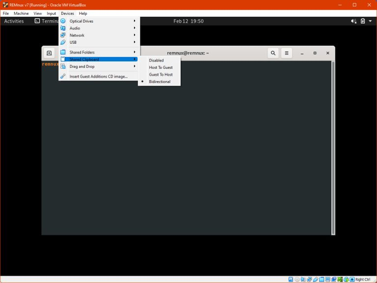

+++
author = "Carlos Guerra"
title = "Analysis of malicious documents – Part 01 – Introduction and VMs"
date = "2023-01-01"
description = ""
tags = [
    "maldocs-series"
]
categories = [
    "guide",
    "author",
    "en",
]
series = ["Malicious documents tutorial"]
aliases = []
image = "6.jpg"

+++

> This series was posted originally in the [Greater Internet Freedom program website](https://greaterinternetfreedom.org/course/part01-intro-and-vms/), this is a copy for archiving purposes

## Intro

This (mini)course is aimed at those digital security enthusiasts and practitioners (technical support, facilitators, first responders, etc.) that want to learn more about malicious documents and how to identify them. These documents can be email attachments, files on flash drives, or downloads from specific websites. The main goals are:

-   Learn the basics of how common document formats work and how they can be weaponized, with special emphasis on Portable Document Format files (PDF) and Microsoft Office documents (from at least MS Word, Excel, and PowerPoint).
-   Introduce a few tools that might help identify signs of dangerous documents or confirm that they are safe to open.
-   Provide some security advice and clarify common doubts about handling suspicious files.

This course uses the format of short reads and quizzes in most of the covered content, where depending on the material, it will be necessary to run some tools. This will be covered in the section Working environment shortly after the introduction, the general requirements are:

-   To complete the proposed exercises:
    -   Capacity of running 1) a virtual machine in the computer using Virtualbox or similar software, or 2) python scripts (only to analyze the course files, not to analyze real samples).
-   The time to cover the material (approximately 2 hours)

This course takes materials available in other references, and only uses tools that are freely available. Most of the content is inspired by the work [Didier Stevens](https://twitter.com/DidierStevens) has done over time, especially for SANS, as well as other references, a shortlist might be:

-   <https://blog.didierstevens.com/2011/05/25/malicious-pdf-analysis-workshop-screencasts/>
-   <https://github.com/filipi86/MalwareAnalysis-in-PDF> 
-   <https://www.sentinelone.com/blog/malicious-pdfs-revealing-techniques-behind-attacks/> 
-   <https://www.youtube.com/watch?v=opdVFQEBCNU>
   
## Structure

1.  Disclaimers
2.  Some threat modeling considerations
3.  For each kind of file format (PDFs, MS Office)
    1.  How they are structured (in a more technical way)
    2.  How they can be weaponized
    3.  How we can do an introductory analysis
    4.  Some conclusions/facts about the file format
4.  Some general advice against the related threats
5.  What's next

Up next, a series of useful disclaimers before starting with the material

## Disclaimers

Given the nature of the task we will perform after mastering the content provided (analyzing malicious and dangerous files), and the complexity of the topic (that we see as an introduction to malware analysis), we strongly recommend reading this section and agree with all the items before moving forward.

1.  This course is introductory: it is designed for people without previous experience in suspicious document analysis. In the Next steps section, we included a list of resources for further reading and reference.
2.  This course is not covering many advanced techniques: there are many specific threats whose complexity goes beyond the scope of this material, also, as in everything information security-related, there might be threats waiting to be discovered that won't be covered in this course. We recommend looking for help in case we suspect we are seeing an advanced or unknown threat in a file or any other artifact, more of that in a later section. That said, this course will help us understand better how a benign file usually looks like, instead of how every malicious document is structured.
3.  Take your precautions when analyzing real files: the samples used in this course are harmless, that said, repeating the presented workflows in real samples without the respective security measured, most probably will result in your device being infected. Please don't run any suspicious file in your main computer, use a virtual machine, a dedicated device, or an environment where you can't execute the file on your machine but only analyze its properties.

### Disclaimer quiz

Question 1: I understand the risks of analyzing suspicious files, the potential consequences of running malware on purpose or accidentally, I read the content of this page/section, and I understand the most common strategies to address these potential threats.

Question 2: Which one of the following options describes best what we need to do when analyzing a real suspicious file?\
1\. We should start a virtual machine (VM) or dedicated computer to analyze the file and give it as little access as possible to our host machine and the rest of the network

2\. We can analyze the file in our own computer/environment but without having access to the internet

3\. We should analyze the file in a computer or virtual machine (VM) with less common Operating Systems like Linux or macOS

## About threat models

When looking for advice on how to deal with suspicious files, usually the proposed approach is to avoid any interaction with the files, for instance:

-   Don't open unknown files.
-   Don't interact with suspicious files.
-   Don't make eye contact with any suspicious file.

Or, we can find another kind of advice that, while is enough for most people, could be misleading to sensitive users like Human Rights activists or journalists working in dangerous environments, or plainly counterproductive, for instance:

-   Using an Antivirus is enough to protect you from malicious files.
-   Only Microsoft Office documents with macros are dangerous, so you can treat other kinds of files without worrying too much.
-   Delete any email with suspicious attachments. This one is particularly concerning in some scenarios because if we delete the emails and attachments from our inbox, we lose key evidence that can help us assess if the artifacts are indeed malicious or targeted, which might be invaluable information.

In practice, when we are working with targeted communities (especially journalists), not interacting with files is not an option. Many organizations, groups, and individuals need to open potentially dangerous files as part of their job, and they will do it even knowing the risks, some examples:

-   Journalists receive a press conference invitation.
-   Activists receive a support document as evidence in a human rights violation case or as a leak.
-   An adversarial institution sends a document that should be reviewed and addressed.

One extra factor to consider is that civil society actors are exposed to targeted threats unknown by Antivirus engines. Another one is that depending on the kind of attack; other file formats might be weaponized as well. These factors are essential to be considered by people helping vulnerable groups to better understand how documents and other common file formats might be weaponized, to give useful advice, but also to help them analyze specific files to understand and assess if they are being victims of targeted attacks.

With all of this in mind, we will be focusing on understanding how standard file formats are structured, how to spot the most common attacks using them, and some updated defensive measures to avoid being victims of this kind of threat.

### Threat model quiz

Question 1: For a highly targeted organization receiving many Microsoft Office documents via email, which one of the following options is true? (Only one is correct)\
1\. Even if the antivirus (AV) software says the file is safe, it might still contain malware.

2\. They need to delete any suspicious attachments immediately because it could be dangerous to have them in the inbox.

3\. They should not open any attachments from unknown sources.

## Environment: General considerations

To execute most tasks on this course we'll use basic tools written in the Python programming language, given the wide compatibility of Python with every Operating System, there are countless ways we can set up an environment, we propose one specifically but if you are familiar with Python, malware analysis, and/or virtualization you can set up a different version that works for you. The only strong ask would be to have an isolated environment to manipulate dangerous artifacts (files in this case), there are other considerations, but probably this is the most important one.

### Isolated environment and other good practices

The samples used in this course are harmless, only to demonstrate how the files are structured and how to spot red flags, however, if you intend to analyze real files, chances are that you will find an infected one that could cause all kinds of problems, like infecting the computer you are using, compromising your information, or making your device unusable, among others. That said, is common practice to have an environment exclusively to analyze and run suspicious samples in a controlled way, so if anything goes wrong while manipulating the sample, you won't affect your device or the information contained in it. 

Another advantage of having a dedicated environment is that after you manipulate malware samples, you can delete everything and start over without the fear of losing unrelated files. This allows us to plan practical ways to "reset" our environment to a ready-to-go state before each analysis.

One of the most used strategies to guarantee an isolated environment is using virtual machines (VMs), which basically emulate a complete computer inside another computer, including the Operating System (OS), hard drives, screen, etc. Common tools to set up and use VMs are [Virtualbox](https://www.virtualbox.org/) and [VMware Workstation Player](https://www.vmware.com/cl/products/workstation-player.html), among others. Using dedicated hardware is also an option as long as it is secured in case of infection.

One potential disadvantage could be that some malware include code to check if they are executed in isolated environments and not run, making it more difficult to analyze it, however, the inherent danger of running malware in our everyday environments doesn't worth even trying, we recommend looking for help, focusing on techniques that don't rely on running the suspicious files, or getting information on how to set up an environment that looks like a real machine for a malware sample. For this resource, this shouldn't be a problem since we won't be executing any code from documents, but if you want to learn and conduct dynamic analysis on suspicious files, this will be useful.

### Other considerations

Besides the good practice of having an isolated environment, other common practices are:

-   Make sure the computer you are using is not connected to the internet or the local network: especially if you are opening suspicious files, the most frequent reason to do this is to avoid triggering signals that will alert malware operators that the code is being executed or tested according to other data like the IP address, or type of device executing the malware. Also, some malware will try to propagate to the local network, trying to infect other unintended devices, so it's a common practice to isolate testing devices in different physical or virtual networks (or VLANs). Keep in mind that in case of analyzing a sample by executing it, it is possible that the malware detects it doesn't have access to the Internet and not run.
-   If you will connect to the internet, use a VPN or similar: the idea is to hide your real location in case the malware we are analyzing runs and signals their operators. Again, it is not usually recommended to execute malware without measures to avoid any potential communication with operators, however, using a VPN might be a good measure in case of accidental execution or if other configurations fail at some point.
-   Arrange a process to reset your environment to a "clean" state: Depending on if you are using a Virtual Machine or dedicated hardware, there are some tools and features that are useful to reset the environment so every time you analyze a sample, the machine will be clean, for VMs using snapshots are a good example, and there is software to reverse a physical computer to a previous state.
-   Stick to static analysis: In general, we can divide malware analysis depending on if we are executing the samples or not. Static analysis tries to dissect the files and other artifacts to gather as much insight as possible without executing them, while dynamic analysis executes the samples to see what changes in the testing environment. Depending on the kind of malware, one kind of analysis might be more useful than the other, but in general, dynamic analysis will require more measures to protect the testing environment and the network to be able to support the execution of real malware. This course only shows static analysis techniques.
-   Be careful when publishing samples or other information of the analyzed samples: In general, this might alert malware operators about us analyzing the malware campaign, making them shut down the infrastructure, cleaning any traces to make attribution more difficult, etc. This applies to any public platform like social media, and websites, including some public platforms where we can send files to analyze them on the cloud looking for flags from Antivirus engines and the information security community. For the last scenario, we'll share some examples and techniques to check the information we need without alerting anybody.

### Environment quiz

Question 1: Which one of the following statements is true?\

**Incorrect** -- Executing malware will infect the environment we are using, causing things like notifying the creators, the malware trying to infect other devices in the network, and making the device unusable. All of these consequences require more security measures than analyzing the sample without executing it (known as Static Analysis) 



**Correct** – Without internet access, the malware won’t be able to communicate with external servers to execute certain actions, including notifying its execution. It is good to know as well that some malware use the internet to download other parts of its code, so cutting access might also be a problem because we won’t have insight into the entire functionality without obtaining the missing pieces. However, the risks associated with running accidentally the malware, make it better to be disconnected and see during the analysis if we are missing something important.  

\

**Incorrect** – What makes VMs more efficient to use for malware analysis, is the ability to take “snapshots”, so we can take one capture of the state of a VM before we start the analysis, and when finished we can revert the VM to that snapshot, so we are ready to analyze the next sample in a controlled way. This is way faster than recreating the VM from scratch every time. (This was a tricky one to be honest)



## Environment example: Remnux + Virtualbox

In case you want a functional environment ready to go, we recommend using Remnux, a downloadable virtual machine (VM) preconfigured with some useful tools for malware analysis. Here we will use Virtualbox to virtualize the Remnux machine, if you are familiar with this process, feel free to jump to the next section of the course.

### Installing Virtualbox

First, we will need a program to manage our virtual machines, we chose Virtualbox because is the most used solution that is compatible with the three main platforms (Windows, macOS, and Linux) and is free. To download the respective installer visit <https://www.virtualbox.org/> and look for the big blue button. Then, look for the section with the packages by platform as shown in the image.

Here, click on your platform, and follow the instructions. After that, you can run Virtualbox and see a window like this one

You won't have anything yet in the blurred area, from here we are ready to download and install Remnux

### Installing Remnux

Now, you can go to <https://remnux.org/> and click on "Download" In the corresponding section. It is possible that you get redirected to another page asking you to select if you want to download a General OVA or a Virtualbox OVA, in our case, the last will be the correct one.

> After downloading the file, it is recommended to check if the file was downloaded correctly, to do this, we need to check the associated hash of the file. Hashing is a dense topic we encourage to learn and apply (also it is very used in malware analysis), but for now, we can summarize it as a mathematical process that transform a piece of data (like a text, or a file), into an alphanumerical code, this code should be unique to the data you are analyzing, and even with small changes, the hash will change a lot, so checking that our downloaded file has the same hash published in the Remnux website, will tell us that the file was downloaded without issues, if the hash is different, it would be a sign that the file was corrupted because a faulty download process or somehow it is not the correct file (maybe an error on our side selecting the right version, or as a remote scenario, someone changed the file for a malicious version, so be alert). A quick reference on how to check hashes is available at <https://technastic.com/check-md5-checksum-hash/>

After checking that our file was downloaded without issues, now we can import it into Virtualbox, in the Remnux page where we downloaded the VM, there are instructions available, however, it is enough with double-clicking the .ova file, and a wizard will guide us through the import process. We can leave everything as suggested in the proposed configuration. In the end, we should see the Remnux machine in our Virtualbox window. Clicking "Start" will turn on our machine in a separate window. This is a Linux machine, and to log in the user is *remnux* and the password *malware *(however, it is possible that the session will be open without prompting for credentials)*.*

## Extra configurations on Virtualbox -- Network

Given that we will be analyzing potentially harmful files, it is not advisable to run the machine in a way that can communicate with the rest of our network, the specific strategy might vary depending on the style of the analyst, however the configuration is done mostly in the interfaces screen of out VM. With our Remnux machine powered off, we click the button "Settings" in the toolbar.

Then in the “Network” section, you will have a series of options, the most important are:

-   Enable Network Adapter: disabling this will eliminate any connectivity between our VM and other devices through the network (Including ours, we will manage it using the graphic interface), it will emulate the absence of hardware to connect to any networks in the VM.
-   Attached to -- NAT: The default configuration, will emulate a new network for the VM, this allows it to access the internet, but also other devices of our network, this is not recommended for the kind of use we will give our VM.
-   Attached to -- Bridged Adapter: This will share the network adapter of our physical host computer to the VM, putting it like any other device on our network. This one is also not recommended for our use case.
-   Attached to -- Host-only Adapter: this attaches the VM to a network that is only connected to only our host machine and other VMs with the same configuration, in some cases this might be useful, however, this can also expose our machine to malicious activity.
-   Attached to -- Internal Network: similar to the last one but our host machine is not accessible, this is useful when we want to see how two or more machines interact with each other.
-   Attached to -- Not attached: This emulates a network adapter without a cable connected to it

Depending on the use we will give to our machine, for initial configuration we can keep NAT enabled to access the Internet to download tools, etc., and before starting our analysis, we can change it to Not attached, Internal Network, or disable the adapter.

## Extra configurations on Virtualbox -- Sharing information with the host machine

It is very usual to share files and other data between our computer and the VM, again, there are different approaches we can adopt:Shared folders: similar to a network shared folder, we can synchronize one folder between our host and our guest system (the Virtual Machine). This is not always recommended to share malware samples because it will open a space in our computer that is controlled by our VM, which can be infected in moments of our analysis. To configure shared folders there is a dedicated section in the settings.

-   Shared clipboard and Drag and Drop: This will let us share the clipboard between our computer and the VM, this can be disabled, be unidirectional, or bidirectional as suggested in the image. Similar for dragging and dropping files between the host and the guest systems. For some, disabling sharing folders and enabling drag and drop only from "Host to Guest" is the most secure option to protect out physical computers, similar with the clipboard sharing, however, in some moments we might need to extract information from the VM.

## Extra configurations on Virtualbox -- Snapshots

One very useful feature of Virtualbox, is to save a version of the VM we can revert to at any given point in the future, so for instance, if we configure the Remnux machine to analyze malware, we might want to save a Snapshot before starting the analysis, so when we are over, we can revert the VM to the saved snapshot to be sure the machine is not infected, and we are ready to continue analyzing.

To save a snapshot, with the machine in the desired state click "Machine", then "Take Snapshot"

Then select a name and click “OK”, it will take some time to build the snapshot and after that it will be available on the Snapshots section on the Virtualbox main screen for our VM.

We can use the “Restore” button on the respective screen

## What's next

Given that we can handle the basics with Virtualbox, we can learn about Remnux while understanding and analyzing our first file format: [PDFs](/p/analysis-of-malicious-documents-part-02-pdf-documents/).