+++
author = "Carlos Guerra"
title = "Analysis of malicious documents – Part 02 – PDF documents"
date = "2023-01-02"
description = ""
tags = [
    "maldocs-series"
]
categories = [
    "guide",
    "author",
    "en",
]
series = ["Malicious documents tutorial"]
aliases = []
image = "13.png"

+++

> This series was posted originally in the [Greater Internet Freedom program website](https://greaterinternetfreedom.org/course/analysis-of-malicious-documents-part-02-pdf-documents/), this is a copy for archiving purposes

After the overview of [virtual machine management and installation of Remnux as an environment to analyze suspicious artifacts](/p/analysis-of-malicious-documents-part-01-introduction-and-vms/), we will explore PDF files in terms of format and ways they can be used to harm users.

## What is a PDF?

When we open a PDF file, we use specific software that render its content in a readable way, however, as many other file types, PDFs are built using a combination of regular plain text and binary data (for images and other elements that might require it), for instance, the following text renders the PDF file showed after:

```
%PDF-1.4
1 0 obj
<<
	/Length 51
>>
stream
1 0 0 RG
5 w
36 144 m
180 144 l
180 36 l
36 36 l
s
endstream
endobj
2 0 obj
<<
	/Type /Catalog
	/Pages 3 0 R
>>
endobj
3 0 obj
<<
	/Type /Pages
	/Kids [4 0 R ]
	/Count 1
>>
endobj
4 0 obj
<< 
	/Type /Page
	/Parent 3 0 R
	/MediaBox [0 0 612 792] 
	/Contents 1 0 R
>>
endobj


xref
0 4
0000000000 65535 f
0000000010 00000 n
0000000113 00000 n
0000000165 00000 n
0000000227 00000 n
trailer 
<<
	/Size 4 
	/Root 2 0 R
>>
startxref
344
%%EOF
```


From "[How to create a simple PDF file](https://help.callassoftware.com/m/73261/l/798383-how-to-create-a-simple-pdf-file)" from Callas Software

### File structure

From this example, we can see the standard structure of any PDF file:

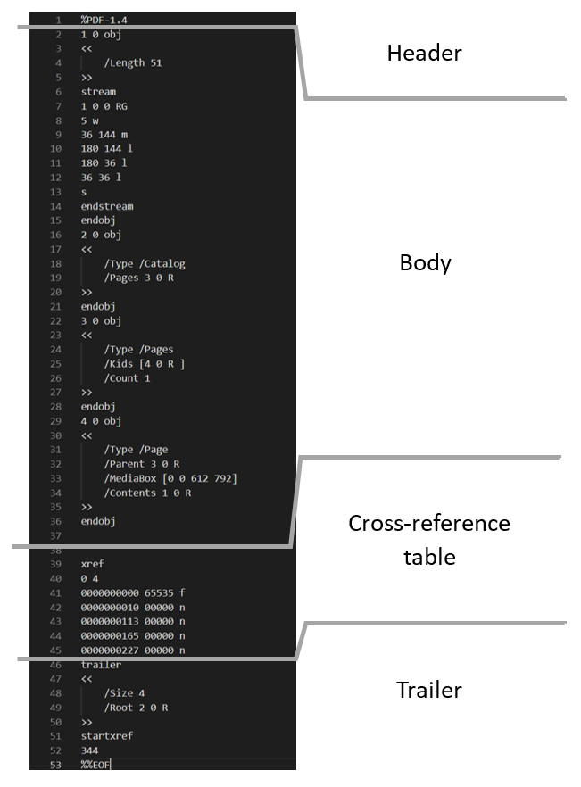

**Header:** Containing the version of the protocol the file was built with, to instruct the reader program how to read the rest of the structure and render all its elements.

**Body:** Here will be all the objects composing the PDF file, pages, images, text, fonts, etc. Even code and automated actions if the file has them.

**Cross-reference table:** Here we'll find a list of all the objects of the document for easy access and their respective places inside the file. This is similar to a 'table of contents' but for the PDF reader software to read. If at any given time the reader needs to render a specific object (for instance, if we scroll to a random page on a big document), the reader software will see what page should it render, and look it on this table to locate the respective elements in the body to load them on the screen.

**Trailer:** Here we will find the place in the document of the cross-reference table and other useful information, like the number of objects in the cross-reference table (to check that the file is not corrupted for instance), the root object of the document, and encryption information if applicable. PDFs readers by design start reading the documents from the end, where they can find quickly where is the root object, and the cross-reference table to start rendering content.

### Understanding PDF objects

Given the way PDFs are structured, the most interesting section to deep into is the body, because there we can found everything we can see and interact with (text, pages, images, forms, code, etc.). All of these elements are called objects, and there is a wide range of them according to the specifications, for instance, in the example above, the object

```
4 0 obj
<< 
	/Type /Page
	/Parent 3 0 R
	/MediaBox [0 0 612 792] 
	/Contents 1 0 R
>>
endobj
```

is a page with the id 4, has a parent element with the id 3, and contains as child the element with id 1 (the red rectangle). Showing the exact way each object is written is outside of the scope of this material, however, there are some kinds of elements that might be used for malicious purposes, and we want to cover them a little more.

**/OpenAction:** This object reference a set of actions to be executed when the PDF file is opened, this might be used to launch a website to support the content or for tracking purposes, execute JavaScript code, etc. This might be used to trick users into executing extra actions that can be harmful, or depending on the computer environment, this object can execute malware directly.

**/AA:** This object also includes a series of actions that are triggered under varying circumstances, like visualizing a page, hovering the mouse pointer over specific objects, filling form fields, etc. The associated risks are similar to the /OpenAction object, but with many more trigger scenarios.

**/JS** or **/Javascript:**  Contains JavaScript code to be executed after an action is triggered, this code might include functions exclusive to PDFs.

**/Launch:** Tries to launch an external application on the device after an action is triggered, this might be used, for instance, to open other documents or execute specific commands, which might be harmful.

**/EmbeddedFile:** Allows the inclusion of arbitrary files, from documents to executables inside the PDF file. There are antecedents of benign PDF files containing other harmful files embedded, like malware executables or Microsoft Office documents with malicious macros.

**/ObjStm:** Contains arbitrary information that will be processed according to the way it is called. The main use for this object is for grouping many objects and compressing them, resulting in a smaller file. However, this might be used as well to compress malicious code as a way to obfuscate it and avoid antivirus detection. Given the many different use cases for this type of object, assuming its presence as malicious will lead us to many false positives.

In more elaborated attacks, a combination of these objects can be used, for instance, a PDF file might trigger an action that opens a file that is embedded in the same file encrypted in a /ObjStm.

Considering all of this, we want to know if a file has any of these object types as a first step to see if a PDF file is malicious, or at least to make sure it is not.

## Enter pdfid

Given that we know where to start looking for red flags on PDF files we might consider suspicious, we can start using the tool pdfid as the first step to see which object types are contained in our file. Pdfid is a part of a [suite of tools](https://blog.didierstevens.com/programs/pdf-tools/) developed by Didier Stevens to streamline some analysis processes on PDF files. These tools are executed using the command line, so they are known as CLI (Command Line Interface) applications. We'll be explaining how to use them using the Remnux Virtual Machine we set up in the previous part of this course.

To use pdfid, we need to open a Terminal application in our virtual machine. When we start our VM this window should be already opened, however, we can always click the Activities menu in the top left corner, and then the Terminal icon in the left panel, as shown in the image,

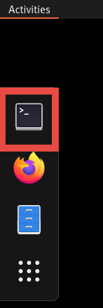

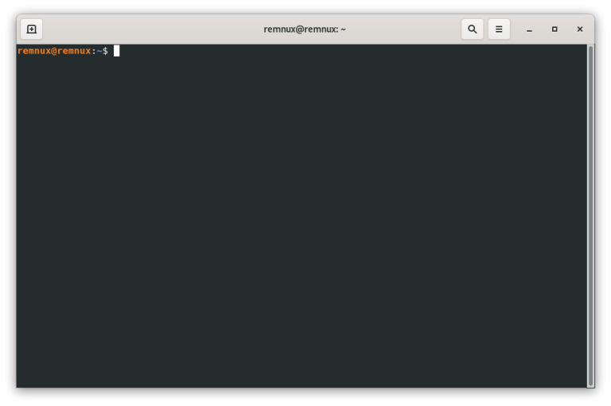

Once in the Terminal window, we can start exploring the use of the pdfid command though its help, we only need to type

```
pdfid.py -h
```

`-h` is for "help"

Tip: we can always use the Tab key to autocomplete some commands

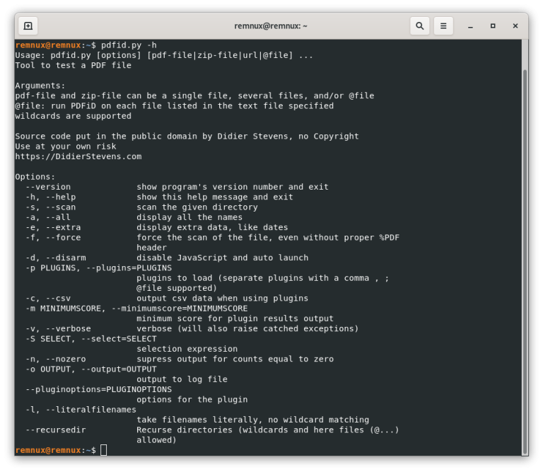

Here we can see a number of options we can employ when using pdfid, this might look challenging for those new to using the terminal, however, we usually stick to a few of these options, and also with little practice, the process becomes faster and easier.

To analyze our first file, we need to keep present that the command we run in the command line is running “from a folder/directory”, so we need to know where are running the command from, and where is located the file we want to analyze. To give you some context, each time we open the Terminal application in Remnux, we are opening a terminal in the Home directory, the same location that we see when we open the Files application


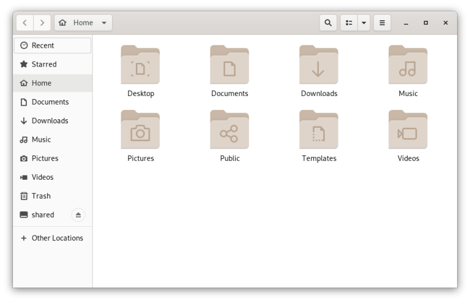

To make things easier for now, we can put our PDFs in this folder, so the terminal command is executed from the same directory as our PDF file.

We can take our example file from above and save it as a pdf file with the help of a text editor on our host computer and drag and drop the file into the Remnux home directory.

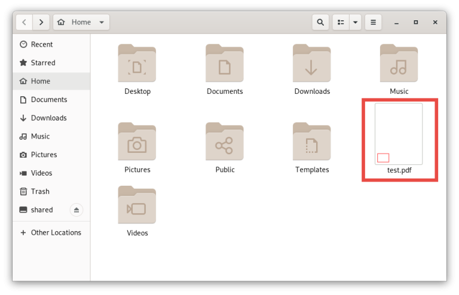

And with this, we can run the following command in our Terminal:

```
pdfid.py test.pdf
```

To receive this response:

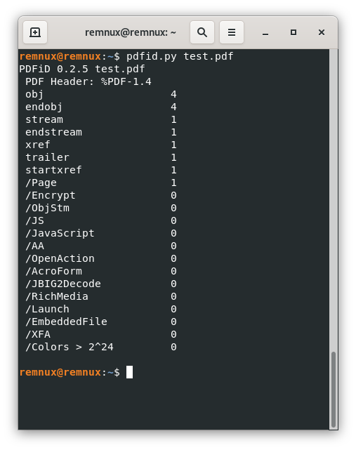

As we can check, all the objects seen by pdfid match with the ones we know from the source of the PDF file, and none of them seems to be in the list of suspicious objects we described above.

> As we stated before, there are techniques malicious actors employ to avoid easy detection of specific kinds of objects, pdfid tries to show even obfuscated objects, however, in some less common cases, there might be hidden objects that will require diving a little deeper to discover.

## Enter pdf-parser, example 1

Now, what happens when we find a pdf file with a suspicious object? Imagine we have a file ex005.pdf that gives us an output like this on pdfid:

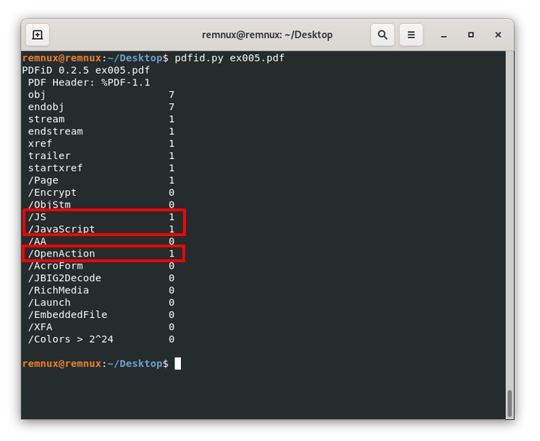

From here, and the guidance above of this resource, we know that there are 3 objects of the types /JS, /Javascript, and /OpenAction that could be interesting to review, especially because they suggest that the file is trying to execute some action when we open the file. Here, we can process it with pdf-parser to get which object type is each object and to see the content of said objects. For our example file, we will execute the following command:

```
pdf-parser.py -a ex005.pdf
```

We use the argument` -a` to see file's stats, for a better reference we can always use `pdf-parser.py --help` to see a list of options on the screen.

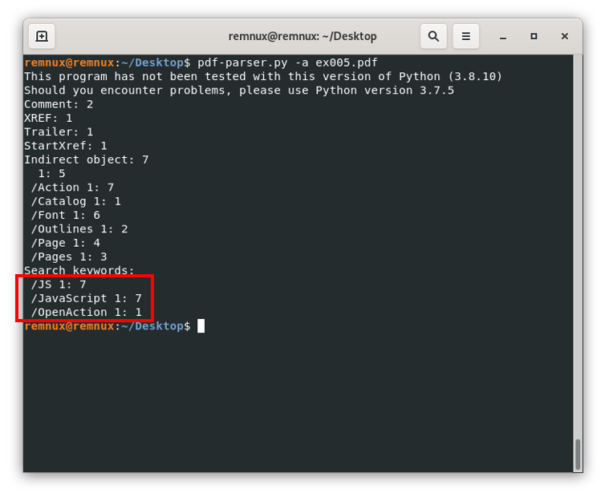

Here, we can see that indeed we have these three problematic objects, but also some additional information, we can see the id of the objects for each object type. Now we know that the /JS and /Javascript object(s) are living in the object with id 7, and the /OpenAction one is living in the object with id 1. Next, we can see the content of the /OpenAction object to see what the document is trying to do when opening it, for this, we use the command

```
Pdf-parser.py -o 1 ex005.pdf
```

Here the `-o` argument is used to give the tool the id of the object which content we want to see on the screen:

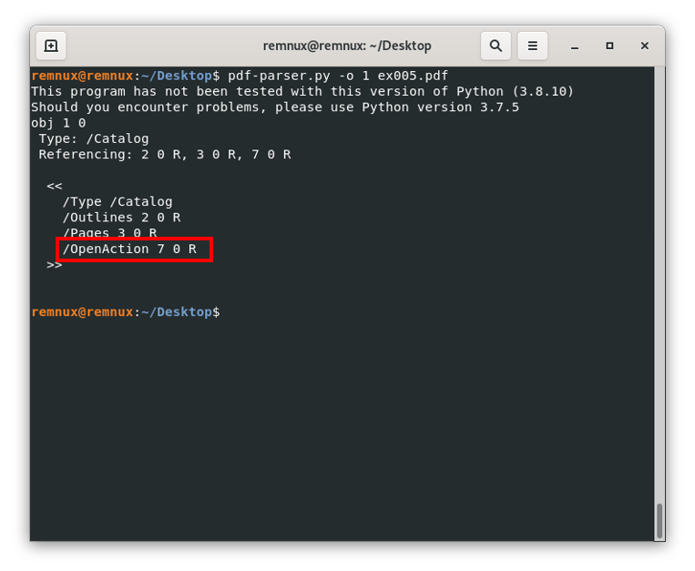

Here, we can see the line “/OpenAction 7 0 R”, this means that the actual content of the /OpenAction object is living in the object with id 7, and when we open the file, we will call or reference said object. Repeating the process to see the content of the object with id 7 we get:

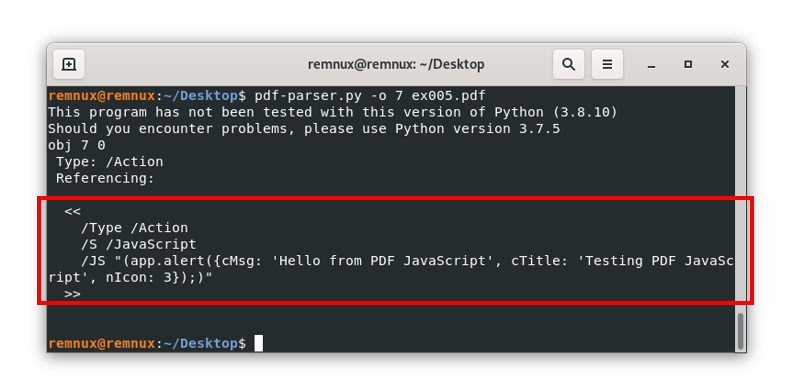

Where we can see that the document is trying to show an alert or pop-up with the message described in the terminal, if we open the file it will look like this:

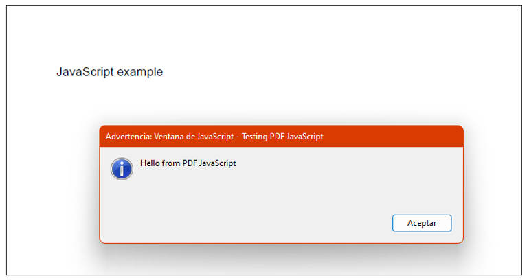

## Example 2

As we mentioned before, there might be files in which suspicious content is not viewable in plain text, there might be a number of reasons to do this in legitimate cases, like compressing long pieces of information to reduce the size of the file among others, however, malicious files employ these techniques with obfuscation purposes to help avoid detection by antivirus software and other security solutions. For instance, if we repeat the previous workflow to the file ex006.pdf, we will see that the output for the pdfid command is the following:


Here we can see in the /JavaScript line “1(1)”, this means that pdfid detected an object of this type, but obfuscated, repeating the same workflow we already know, we review the object with id 8 (where the JavaScript code resides) to see the following:

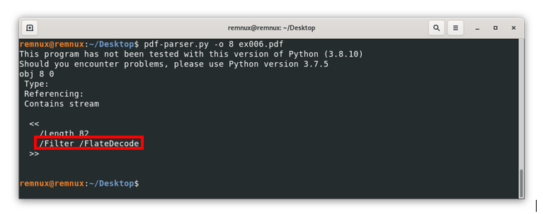

Here we can’t see the actual code like in the last example, instead, we see among other things the line “/Filter /FlateDecode”. The /Filter option executes an operation on the final content of a stream to decode it, then /FlateDecode indicates the associated encoding that should be considered when decoding the content, to give a better sense of this, if we open the file with a text editor and search manually for this element we should see something like this:

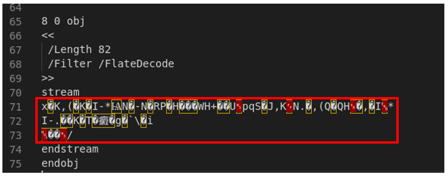

Where the content inside the red square is the actual encoded content, for this case, pdf-parser can try to decode the actual content, for this we use the argument -f, so we end up using the command

```
Pdf-parser.py -o 8 -f ex006.pdf
```

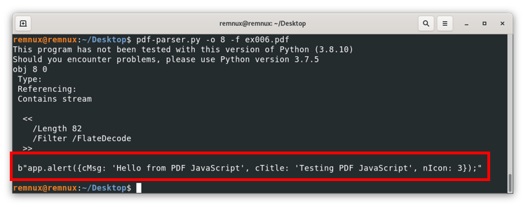

Where we can see the actual content of the object to be rendered by the PDF reader.

Now that we know the basics of how to review PDF files to look for suspicious objects, there are a couple of challenges for you.

## Example 3

Another thing PDF creator software does usually to build new files is to create objects inside streams that are encoded to make the resulting files smaller, this is desirable in general, but also creates a way to further obfuscate malicious code, analyzing the file example3.pdf we see some /ObjStm (Object Streams) that might contain (and they do indeed) other objects that might be interesting.

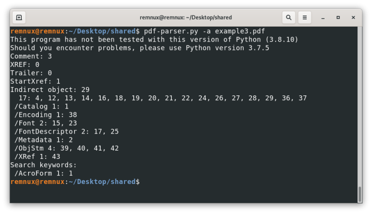

For this kind of scenarios, it is advisable to use the option -O (as in capital o) of pdf-parser, this option will try to parse any stream containing an object and treat them as regular objects of the file, for instance, using this option like this.

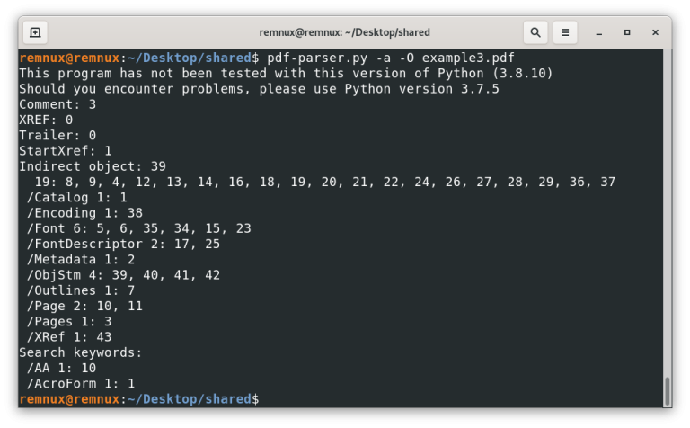

Reveal that the file has “new” objects and that one of them is an /AA, which is interesting to look for malicious behavior, looking at the respective object we have


Telling us that the action is tied to a page object, in this case the /O is indicating that the action is triggered when we open the page, and the actual action is stored in the object 37, then

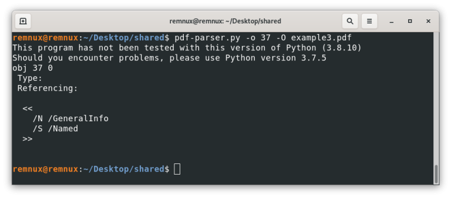

After some research, we can conclude that this object tries to open the properties dialog of the pdf reader like this (nothing especially dangerous – example in a computer configured in Spanish)


Conclusion: try to use the -O parameter in case there are other objects hiding inside streams

## Challenges

**Question:** analyzing the file [challenge1.pdf](https://drive.google.com/file/d/1BkV1JcWmiuE2_neOCuEiSeY00hM9pK11/view?usp=sharing) (md5: 3b20821cb817e40e088d9583e8699938), what kind of interesting object is hiding behind a stream?\

**Incorrect** -- 
  

**Correct** --   
  

**Incorrect** --  
  

**Incorrect** --   


**Question:** analyzing the file [challenge2.pdf](https://drive.google.com/file/d/1dSdWgBAM9IP4-BNCFVpRuwukGJkb823F/view?usp=sharing) (md5: 30373b268d516845751c10dc2b579c97), we can see an action that tries to open an URL, what code the URL includes as a tracking code? (hint: 6 numbers)


**88965**


## What's next

Now that we know more about PDFs, lets cover in the next part another heavily weaponized kind of files:[ Office Documents.](/p/analysis-of-malicious-documents-part-03-microsoft-office-documents/)