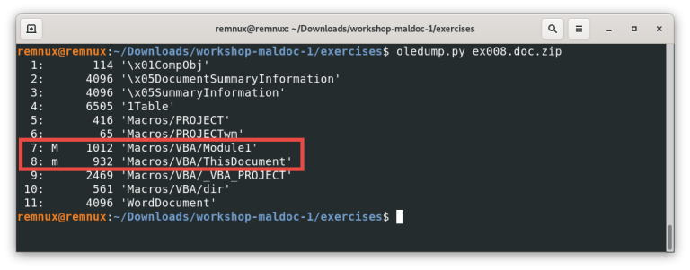
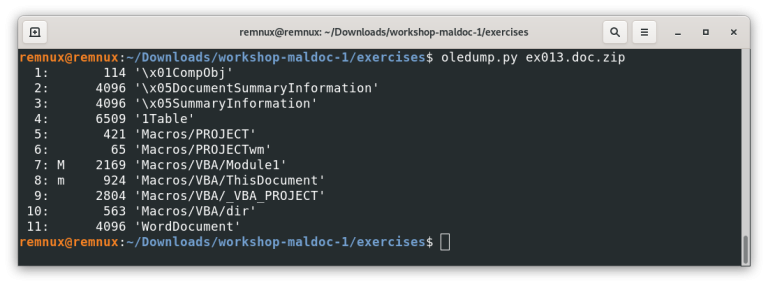
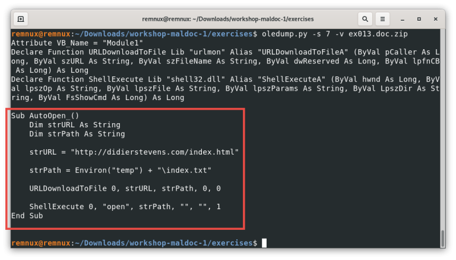
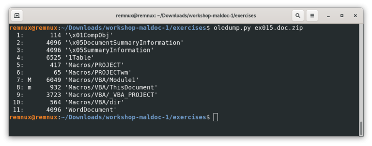
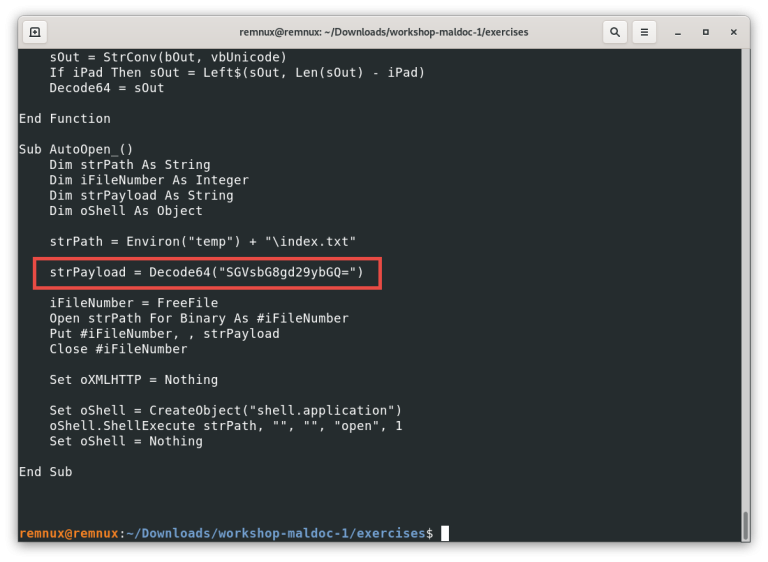
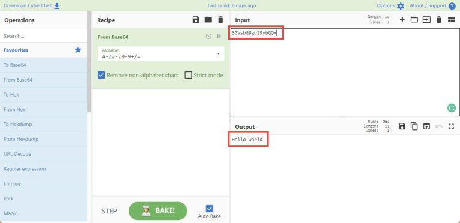
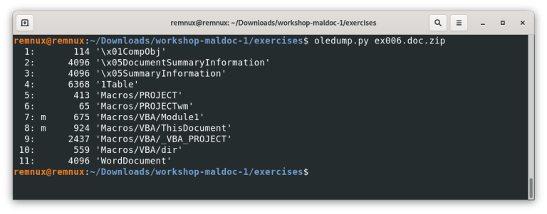

+++
author = "Carlos Guerra"
title = "Analysis of malicious documents – Part 03 – Microsoft Office documents"
date = "2023-01-03"
description = ""
tags = [
    "maldocs-series"
]
categories = [
    "guide",
    "author",
    "en",
]
series = ["Malicious documents tutorial"]
aliases = []
image = "11.png"

+++

> This series was posted originally in the [Greater Internet Freedom program website](https://greaterinternetfreedom.org/course/analysis-of-malicious-documents-part-03-microsoft-office-documents/), this is a copy for archiving purposes

After checking [how to set up virtual machines as safe environments](/p/analysis-of-malicious-documents-part-01-introduction-and-vms/) and presenting an introductory workflow to[ analyze suspicious PDF documents](/p/analysis-of-malicious-documents-part-02-pdf-documents/), we are ready to continue with Microsoft Office file formats.

## Security problems with Microsoft Office documents

In general, office documents are not dangerous by themselves if they only contain the information for what they are designed for: pages with text and other printable elements for MS Word, cells with values and formulas for MS Excel, slides with observable elements in MS PowerPoint, etc.

However, among the many features available in the MS Office ecosystem to add additional functionality to documents, one is specifically interesting from a digital security perspective: the possibility to embed objects in documents. The kind of objects we can embed are many, like math notation, multimedia, other documents, etc. And among all of them, there is one that is especially powerful because it allows the execution of custom code, which might be weaponized to harm the user: the macro.

## Macros

The initial use case for macros In MS documents is to run repetitive tasks easily by "recording" them once and "playing" them repeatedly afterward. You can create macros without having any programming knowledge just by recording clicks on buttons and keyboard shortcuts, then MS Office will translate the recording into a series of commands that will be executed as a "little program" living inside our documents.

When we start diving into how macros work, we start to see how they can be weaponized and why they are so popular in phishing attacks to infect computers vs. other techniques. First, the macros are stored as code written in the Visual Basic for Applications programming language (VBA), which is well documented, simple to write, and powerful. Visual Basic in general is also used for writing entire standalone programs, so it has the capacity to do things outside of the document scope, like downloading and executing files and altering system settings for instance. The associated commands for these tasks are mostly available in MS Office macros as well, so we can write macros that take advantage of the advanced commands available and use them to execute harmful tasks, like download and execute more advanced malware, delete files, etc.

Second, executing macros from documents is really easy. Document creators can configure them to run automatically when opening the file, when clicking a button, link, or any given element, among other triggers. Then for unknown files, MS Office will warn us that their macros might be dangerous and will block them, but we are usually one or two clicks away from disabling this protection and running the macros anyway. This situation makes it very attractive for malicious actors to use macros and convince us that they are safe to run through convincing arguments proper to each phishing campaign.

Comparing PDFs to MS Office documents with macros for malicious activities, MS Office docs offer more possibilities of commands to run on devices opening them, making them more powerful, and also more popular, than PDFs. Also, that flexibility is the reason we are focusing on weaponizing allowed macros inside malicious documents vs. other ways of weaponizing MS Office documents. If you are interested in different ways these files might be used to vulnerate users of outdated office versions, in the end, we are providing links to other references.

> **Office vulnerabilities**\
> There are many documented ways used to exploit macros or office documents in general, however, many of the most creative ones are not possible to exploit in fully updated instances of ms office.\
> As any other program, MS Office might have known or unknown vulnerabilities that could allow to a device compromise, even without using macros.

## The "old" and the "new" MS Office document formats

Since 2003, Microsoft Office changed the way documents are created by default, including new file extensions, so new MS Word documents are stored with the ".docx" extension instead of ".doc" and so on. Even when the internal structure of these two file formats is different, macros are stored in a similar way, then the guidance provided in this material applies to both old and new file formats.

> If you are interested in knowing more about the conventions to store macros and many other kinds of objects, you can research more about Object Linking and Embedding (or OLE), which is still used and adapted to new file formats, including MS Office documents

## Analyzing MS Office documents

To start exploring ways to detect when macros are included in MS Office documents, we'll use [oledump.py](https://blog.didierstevens.com/programs/oledump-py/), a Python tool developed by Didier Stevens, the same author of the tools proposed previously in the previous part focused on PDFs. We'll be also using a series of [example files](https://conference.hitb.org/hitbsecconf2017ams/materials/D1T3%20-%20Didier%20Stevens%20-%20Analyzing%20Malicious%20Office%20Documents.pdf) to show how MS Office documents work and how macros can be detected and reviewed, also from training materials from Didier Stevens.

The workflow to start the analysis of MS Office documents is very similar to the one we used on PDFs. First, we list the different elements present in the file, we identify interesting objects in terms of security, and then we try to get the actual content of those elements to see if there is anything harmful there.

### Oledump.py

The main use of this tool is to list any OLE objects included in any specific file, and show the content of any of them. The basic use of the tool is as follows:

```
oledump.py ex001.doc
```

Where ex001.doc is the name of the document we want to analyze


Here we can see all the elements for a file without macros or other unusual objects embedded in an “old” MS Office filetype, doing the same experiment for a file with the “new” format (after MS Office 2003), we will get something like this.


Here we can see that more elements in the .doc example are stored as OLE objects, while in the .docx example, we have a functional document without using OLE objects. This is because .docx documents are packaged as a .zip file with mostly .xml files inside (you can even try to change a safe .docx|.xlsx|.pptx file to the .zip extension and open it), and only use OLE-formatted data when needed.

When we open a file with macros, the result will include new elements:



> If we look closely at this example, we can see that the file that we passed to the command is a zip file, in this case, this is a .zip file containing a MS word document. Also, the .zip file is password-protected with the password “infected”. This is a common practice in the malware analysis community, and oledump.py considers it as a valid input and manages all the decompression, and passes the document for analysis automatically for us.

In this output, we see 2 objects that are different, and they are identified with the letter "m" or "M". This means that those specific objects contain macros. Let's use the `-s` command in oledump.py to see the content of those streams, starting with the object (or stream 8)


We used the command `-s` to select the object identified with the number 8, and the command `-v` to decompress the content because VBA might compress code by default, so it is a safe practice to include this command when requesting objects with macros.

Now, looking at the content, we see some attribute declarations, these are done by default by VBA and they are not even visible to the document creator, then, this code is not considered custom or harmful to our effects. That said, code known to be harmless by the tool is identified with a lowercase "m", assuming it as safe and less interesting for further analysis. Let's analyze the other object containing a macro.


To give some context, this macro uses the MsgBox command that launches a dialog window with the message “Hello world” in this case. Also, AutoOpen() tells the program that this macro should be executed when opening the file automatically. In practice, an unknown document trying to execute an AutoOpen() macro will trigger a security alert, however, depending on the context, the user might be tricked into bypassing the warning and executing the macro anyway.

To explore the way this might be weaponized, let’s check the following file





Here, the macro of interest is a little more complex than a dialog window with a text message, we can see that again, the AutoOpen() feature is used to execute the code below when opening the document. Looking at the code, with a little help checking the used commands, we can infer that the macro tries to download the content of an URL into a file in the temporal directory of our machine and execute whatever file was downloaded.

In this case, it seems that the file is filling a text file, which should be harmless, but with the right URL and the right filetype used to download the content, a macro like this one can write and execute programs or other harmful artifacts without much user interaction or even knowledge. Also, it is worth mentioning that this macro is a simplified version of more real threats, which usually obfuscate their code to avoid detection by antivirus software and can execute more elaborated actions, like adding the downloaded malware to startup programs or scheduled tasks, so the malware is persistent over time, among others.

Often, analyzing more complex macros will require skills not covered in this material, like decrypting code and figuring out how, through the use of different commands and data structures, we can get the final executed code so we can understand what it does (de-obfuscation). A still very simple example showing a common technique to obfuscate content can be found checking the next file.





Here, instead of using plain text, the creator of the macro used the encoding scheme base64, which makes more difficult to read the payload they are trying to execute. For this example, there are many tools that can help us decode that variable, one of them is [CyberChef](https://gchq.github.io/CyberChef/), a web application where we can input some data, and execute some operations to it to get an output, in this case we have:



With these examples and references, we should be able to know if a file has macros embedded using oledump.py, if a file is interesting to analyze further, and in case its code is simple enough, what the macro is trying to do. In the case of finding documents with very complex macros, the advice is to look for help to analyze the file more in-depth and never try to execute the file in our environments because it could have terrible effects on our devices in case they get infected.

Now that we learned some introductory workflows to analyze PDFs and MS Office files, we are ready to review some defensive strategies to protect ourselves of malicious documents in the next and final part.

## Challenges

**Question:** applying the same workflow to the file [ex006.doc.zip](https://drive.google.com/file/d/13b9TXYWUVt75gz1xjYxFFS-ZocRg2oqQ/view?usp=sharing) we see this output, Which of the following hypothesis check out with the information we got so far?




**Incorrect** --   
  

**Incorrect** --  
  

**Correct** --   



**Question:** applying the same workflow to the file [ex016.doc.zip](https://greaterinternetfreedom.org/wp-content/uploads/2023/07/ex016.doc.zip) we see a macro similar to the last one covered above, where the macro decodes something in base64. What is being passed to the Decode64 function? (hint: aaaaaaaaaaaaaa.aaaaaaa.aaaa)



ActiveDocument.Content.Text  



## What's next?

After having a better idea of how PDF and MS Office can be assessed for malicious code, we can understand better how to propose [defensive measures, and also, we can review final tips](#) on how to conduct this kind of initial assessment.

## Bonus: Further reading on MS Office security

-   [Oletools](https://github.com/decalage2/oletools): another famous tool to analyze MS Office files
-   [List of known vulnerabilities of Microsoft Office](https://www.cvedetails.com/vulnerability-list/vendor_id-26/product_id-320/Microsoft-Office.html) (mostly not involving macros)
-   [CVE-2022-30190 or codename "Follina":](https://resources.infosecinstitute.com/topic/follina-microsoft-office-code-execution-vulnerability/) a recent trendy vulnerability abusing documents to interact with Windows troubleshooting features.
-   ["Uncompromised: Unpacking a malicious Excel macro",](https://redcanary.com/blog/malicious-excel-macro/) an interesting case exploring a malicious file step by step.
-   [Analyzing Malicious Documents Cheat Sheet](https://zeltser.com/analyzing-malicious-documents/), Lenny Zeltser's quick guidance to analyze suspicious documents.