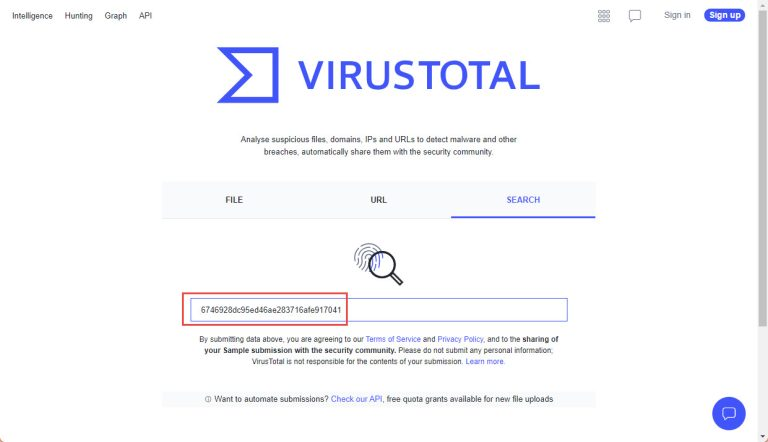
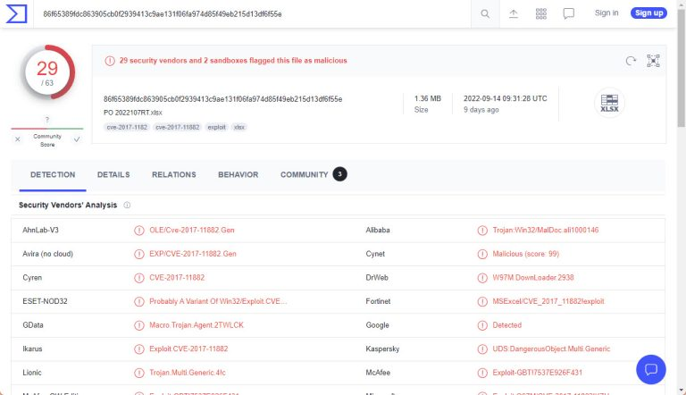
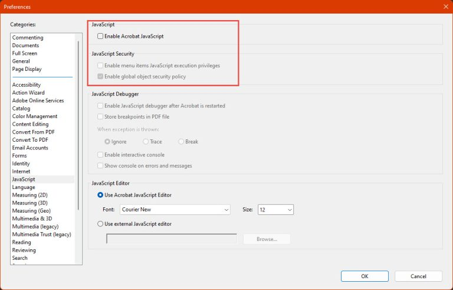
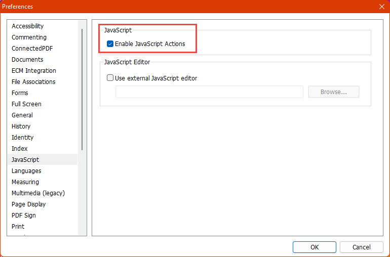
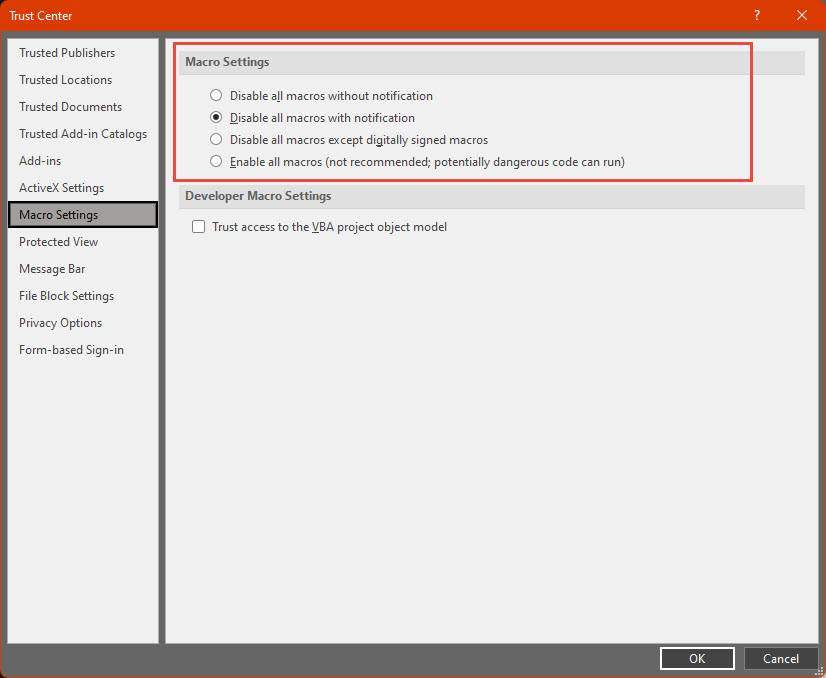
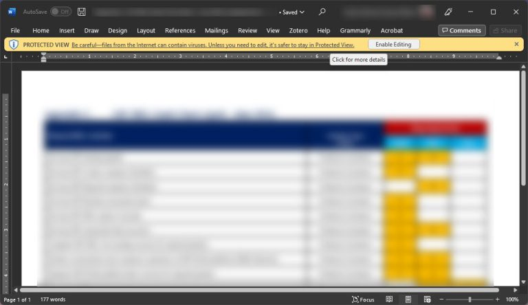

+++
author = "Carlos Guerra"
title = "Analysis of malicious documents – Part 04 – Defensive measures, next steps, and closure"
date = "2023-01-04"
description = ""
tags = [
    "maldocs-series"
]
categories = [
    "guide",
    "author",
    "en",
]
series = ["Malicious documents tutorial"]
aliases = []
image = "1.jpg"

+++

> This series was posted originally in the [Greater Internet Freedom program website](https://greaterinternetfreedom.org/course/analysis-of-malicious-documents-part-04-defensive-measures-next-steps-and-closure/), this is a copy for archiving purposes

So far, we covered an [introduction ](/p/analysis-of-malicious-documents-part-01-introduction-and-vms/)to threat modeling, the use of virtual machines as environments to analyze malware, and how to start analyzing [PDFs ](/p/analysis-of-malicious-documents-part-02-pdf-documents/)and [Microsoft Office](/p/analysis-of-malicious-documents-part-03-microsoft-office-documents/) documents in previous parts. All these topics will help us to give better support to others as the first line of defense against suspicious documents.

Still, if we support vulnerable actors (the primary intended audience of this series of posts), we know that this is only half of the story. We also need to ensure we can provide good proactive advice to our beneficiaries, so they are well protected from malicious documents before they arrive at their hard drives. Hopefully, with all the content we reviewed, we can not only understand better the classic advice we give to end-users but also propose a couple of additional measures that could be useful for vulnerable actors with an increased risk level.

The first idea we want to reinforce is that telling activists, journalists, and media that they shouldn't open files from unknown sources is not sustainable advice. To carry on their activities, many people in these categories need to open files sent to them that might contain threats, like press conference invitations, leaked documents, event agendas, etc. So, the most pertinent advice we can give them is to know the risks and to build processes to let them open the files in the safest way possible.

That said, some defensive measures against malicious documents include

## In general

### Antivirus solutions

Many malicious documents distributed are part of massive operations that are successfully documented and integrated into antivirus detection databases. Keep in mind that this recommendation doesn't guarantee the detection of malicious files that are tailor-made for specific targets. Still, it will give a layer of security that is worth having, especially if operating with many untrusted files. Remember to choose a reputable vendor, activate real-time detection if available, and keep the database updated.

### Keep software legal and updated

Every year there are hundreds of new vulnerabilities are discovered and disclosed for many everyday used programs, including Microsoft Office and PDF readers, and said vulnerabilities are "patched" through software updates. So, having all the software up to date will reduce drastically the chances of someone using well-known and documented vulnerabilities to attack a target and succeeding. Having pirated software will affect its ability to detect and apply software updates, making it a security problem. This is why having original software is advisable from a security perspective, even before addressing legal considerations.

### Review the file extension of suspicious files

Some campaigns trick users into opening harmful files disguised as documents but are other kinds of files, like executable applications, .zip files, or other container file types such as .iso, etc. Usually, these files even include custom icons to look like MS Word documents, PDFs, etc. Checking carefully the files we download and open will give us another layer of protection by catching when a file doesn't have a common or expected file type.

### Use "borrowed" readers

A common strategy is to open suspicious documents in an environment away from your computer that is better equipped to detect and contain any potential threat. A classic example is to open files using Google Drive (this includes previews in Gmail); then,  the file is actually opened in Google's servers and rendered to our computers, making Google (or any other platform with similar capabilities) the actor that has to worry of specific threats contained in opened documents. A downside of this approach is that we lose some visibility and analysis capacity, given that we are not downloading the files, but it will be helpful for everyday use.

### Use specific tools designed for this use case

There are tools that take the same principle of using a safe environment to open files but streamline the process for the user and then generate safe copies that only contain the visible elements (similar to printing the document and scanning the result into a final file). One of the tools is [Dangerzone](https://dangerzone.rocks/), a program that receives a suspicious file and generates a copy that is safe to open. The only notable downside is that the tool requires downloading dependencies of some Gbs of size, so if hard disk space and/or download speeds and stability are an issue, this tool can be more difficult to set up. Another tool for achieving this goal is Circ.lu's [CIRCLean USB sanitizer,](https://www.circl.lu/projects/CIRCLean/) which uses a separate computer (they propose a [Raspberry Pi](https://www.raspberrypi.com/)) and two USB drives. In the first drive, you save the suspicious versions of the files, and the software will generate the safe copies and save them on the second USB drive. The most notable challenges with this approach are using dedicated hardware to operate the files and adding extra physical steps to move files to and from USB drives.

### Checking file hashes in detection platforms

Another common strategy when in front of suspicious files, is checking in platforms like [VirusTotal](https://www.virustotal.com/gui/home/search) if the file is known as malicious. This will help us save time in case the file is a known threat and will even give us more valuable information, like what kind of malware it tries to execute and messages from community members associated with the file. A very important observation is to know that uploading the file to tools like VirusTotal will put the file at the community disposition, disclosing the content of the document (that might have sensitive information), and potentially alerting the document creators if they are monitoring the specific file. A workaround for this is to not upload the file but checking it's hash instead. In the [first part of this series](/p/analysis-of-malicious-documents-part-01-introduction-and-vms/), there is guidance on how to check hashes.

Example of searching for the hash of one file, August 2022

Example of results in VirusTotal, August 2022

## Specific to PDFs: Disable Javascript execution in reader (and other security settings)

Depending on your PDF reader software, the execution of JavaScript code might be already disabled, however, it is advisable to double-check in case you expect to open suspicious files. Also, depending on your reader, there might be other security features that can be configured.

Example for Acrobat Reader (August 2022, Menu Edit -> Preferences -> Javascript)

Example for Foxit Reader (August 2022, Menu File->Preferences->Javascript)

## Specific to office

### Minimize the use of macros in legitimate activities

Even when there are many acceptable and harmless use cases for macros, using documents with them frequently and being used to allow them, might open the door to receiving a malicious document and enabling its macros accidentally, especially organizations should be mindful of this situation and plan accordingly or removing the use of macros, or preparing processes to live with them, considering how to handle untrusted files.

### Disable macros and check the Trust Center

Microsoft Office recently changed its policy regarding macros multiple times, so depending on when you are reading this material, Office might have macros enabled or disabled by default; also, there might be rules depending on the origin of files, etc. One way of having more visibility and control is checking the Trust Center to see and configure directly the behavior towards macros.

Trust Center for MS Office (August 2022, Menu File->Options->Trust Center->Trust Center Settings->Macro Settings)

Another interesting feature in MS Office is Protected View, which considering the origin of a file, opens it in a sandboxed environment with little privilege or access to interfere with the computer, offering another layer of trust. One problem with this mode is that, similar to macro blocking; there is a button in a ribbon above the document where the user can disable the Protected View feature, again enabling attacks where the document creator tricks the user to disable this protection.

Protected View settings (August 2022, Menu File->Options->Trust Center->Trust Center Settings->Protected View)

Protected View for a MS Word document (August 2022)

## What's next

First, when receiving a suspicious file, you will have the skills to run a first analysis to see any obvious security problems; the potential scenarios might be abstracted to these:

1.  If the file doesn't seem to contain anything harmful, we can lower the suspicion level of the file.
    -   If, by any chance, the target has a high-risk level, we might want to double-check with other colleagues or more specialized groups.
2.  If the file seems malicious, we might try to search on platforms like VirusTotal for its hash, and if it is a known malware sample, we will find a lot of more detailed information that will be useful for understanding the nature of the threat, how massive is the campaign, etc.
3.  If the threats contained in the file are easy to detect and understand, but not known by the community, we should be able to give some insight on the specifics when researching more or looking for help.
4.  If the elements contained in the file seem advanced, hard to understand, or even difficult to categorize as threats; and the file hash is unknown to public platforms, it is worth reaching out to more specialized organizations that can take a better look into the files in search of not-so-obvious threats.

Also, we advise in general to:

-   Avoid executing any suspicious code (unless you understand the risks and take the respective precautions, which are not covered in this material)
-   Research more on any specific things you find and you don't know about. There are a lot of different commands and ways to achieve things with code, and it is unsustainable to know all of them, so it is normal and expected to review documentation looking for specific instructions or features to understand better the functionality of a macro or other unknown objects.

Keep in mind that analyzing malicious documents (and malware in general) is a full career that usually requires years of experience to handle more advanced cases. That said, we reinforce that this material is an introduction to a specific portion of malware analysis that hopefully will encourage the reader to learn more and gain more skills in this field. However, given the risk associated to operate malicious artifacts without proper processes and security considerations, we discourage the readers to add more processes and analysis tools to the presented workflows without proper knowledge of those processes and tools, especially those involving the execution of malware (or dynamic analysis).

* * * * *

This is a material in constant revision. For any questions or feedback, please reach out to me :)