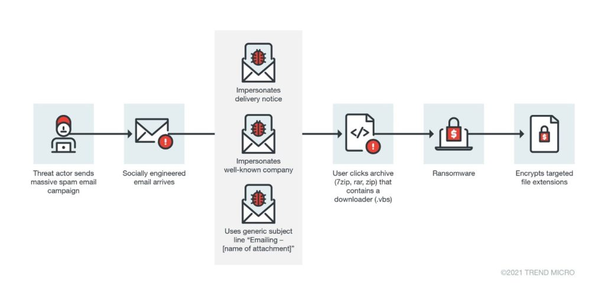
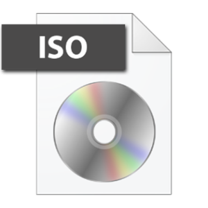
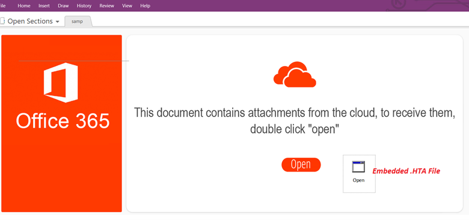
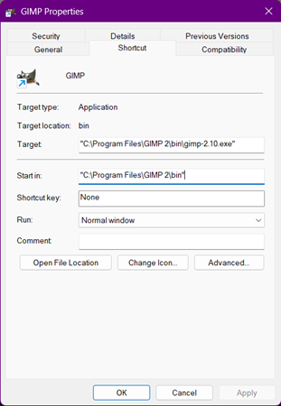
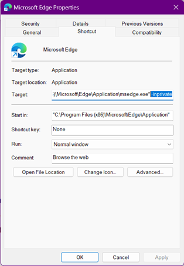
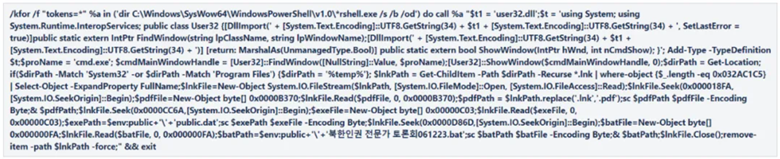
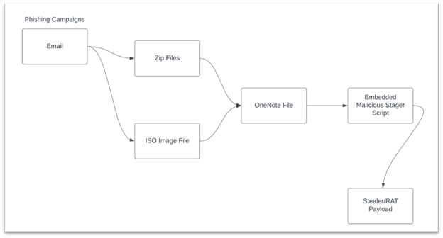

+++
author = "Carlos Guerra"
title = "Analysis of malicious documents – Bonus blog post – More recent techniques in attacks with malicious documents  "
date = "2023-01-05"
description = ""
tags = [
    "maldocs-series"
]
categories = [
    "Article",
    "author",
    "en",
]
series = ["Malicious documents tutorial"]
aliases = []
image = "1.jpg"

+++

> This blog post was posted originally in the [Greater Internet Freedom program website](https://greaterinternetfreedom.org/blog/more-recent-techniques-in-attacks-with-malicious-documents/), this is a copy for archiving purposes

When dealing with suspicious documents at the technical level, we are used to finding resources focusing on Microsoft Office macro-enabled documents (like [our material on analyzing malicious documents](/tags/maldocs-series/)) because they are the most used tools by attackers to trick users into running malicious code on their computers. With this in mind, Microsoft Office [started to limit](https://learn.microsoft.com/en-us/deployoffice/security/internet-macros-blocked) the execution of macros, making it more difficult to activate them to execute code coming from files downloaded from websites and other potentially untrusted sources. While this measure certainly helps prevent a significant number of attacks, it also contributes to the scenario of malicious actors exploring other ways to weaponize legitimate technologies to trick users into executing malware.

To emulate the potential of malicious documents, attackers must identify which file formats and workflows are legitimate enough to bypass common security controls, and powerful enough to allow them to infect devices easily through the victims. Based on observed campaigns during the last years, some of the new techniques are:

## Compressed file containers (file extensions like .zip and .rar)

Image: An example of an infection chain enabled by a zip file, as reported by [TrendMicro](https://www.trendmicro.com/vinfo/us/security/news/cybercrime-and-digital-threats/return-to-sender-preventing-ransomware-while-working-from-home)

Zip files are very popular and useful to store or transmit files, especially when the storage limit or internet data cost need to be considered. In terms of security, attackers can store malicious code inside compressed files, send them through email or other channels, and trick us to extract and/or open them. The good news (a bit terrible in terms of privacy though), is that many services [try to see](https://arstechnica.com/information-technology/2023/05/microsoft-is-scanning-the-inside-of-password-protected-zip-files-for-malware/) if the compressed file contains potentially harmful elements like executables or macro-enabled files, and warn the users or block the access to the file altogether if actual malicious code is found. In practice, while helpful to mitigate infections, there are some cases where attackers sneak malicious code undetected. Also, they are increasingly chaining different attacks together to try to conceal the actual malicious code, but more about that in a bit.

## Disk image container files (file extensions like .iso and .img)

Image: The icon of a .iso file in Microsoft Windows

Like compressed files, disk image containers can store files and can be delivered as just one file. In everyday use, this file format is known as a way of storing disk images in files ("CDs" with Operating Systems (OS) installers, backups of flash drives or hard drives, images used to restore damaged systems, etc.).

Also, like compressed files, they can be used to store malicious code that we can execute if we are tricked to do so. And for instance, in MacOS, this delivery mechanism is very common to install legitimate software. So, under the right conditions it won't be suspicious to download an image file, open it and double-click some file inside.

## Microsoft OneNote notebooks (file extension .one)

Another way to deliver arbitrary files, including malicious code, is the use of OneNote notebooks. They can contain not only regular text and images, but also any kind of file the creator wants to embed for further use, like PDFs and other Microsoft Office files. The way OneNote structures its files is specific to this file format, then, many security solutions might not be configured to analyze the content of OneNote notebooks looking for threats inside embedded files, making this method attractive to deliver malware. However, for this to work, attackers still need their victims to open the OneNote notebook and execute the embedded files.

Image: [Example](https://www.mcafee.com/blogs/other-blogs/mcafee-labs/rising-trend-of-onenote-documents-for-malware-delivery/) of a MS OneNote asking to execute and embedded file

## Microsoft Windows Shortcut (file extension .lnk)

Even when ".lnk" files sound unknown to many of us, this file format is very common. The associated files are called "shortcuts" and if you are using a Microsoft Windows computer, there are good chances that you have some of these on your Desktop to open specific applications (you can recognize them by the little folded arrow at the bottom left of the respective icon when using the file explorer).

In backstage, a shortcut will execute a command in the computer that in most cases will start a program that is living elsewhere in the filesystem, or if it is already started, bring it to the front or open a second instance. Here we can see for our shortcut to GIMP that the actual program lives in a folder inside “Program Files”, even when the shortcut is on our Desktop.

As one of the features of a shortcut, we can pass extra information to the program that might alter its behavior. For instance, in this shortcut for Microsoft Edge we added the argument “-inprivate”, and now the application will know we want to open a window on InPrivate mode each time we double-click the shortcut.

The issue with this in terms of security, is that someone can craft a shortcut making a program do harmful things, like downloading a file, installing a program, sending information to an unintended party, or all the above. This is happening recently more often where attackers find ways to deploy entire pieces of malicious code (usually called payloads) in victims’ computers using just a shortcut. The fact that anyone can change the name and the icon of shortcuts to anything, makes easier to trick victims to think they are clicking something different to a malware or a shortcut.

In this [example](https://mp.weixin.qq.com/s?__biz=MzUyMjk4NzExMA%3D%3D&mid=2247498025&idx=1&sn=336c94786f14060ae5c583dc8c77370b&chksm=f9c1ca20ceb64336d678e5265df8264b81625947557b3ab882ec7f362bdf384ffe42e382ae8a&scene=178&cur_album_id=1955835290309230595) we see the content of a malicious shortcut file that opens Microsoft PowerShell and executes a long malicious code that serves as an initial stage of a real malware infection.

## All of the above

More recently, attackers are conducting infection campaigns that use many tricks together to minimize the chances of being detected before the victim's devices are infected. It is becoming common to read about a campaign that delivers a .iso file containing a macro-enabled document that tries to download obfuscated malware from the internet, or a .zip file containing a .lnk shortcut that copies a piece of malware inside the compressed file to a system folder, among other similar examples. One good thing around these approaches is that they are increasingly looking more strange and hopefully suspicious, but the downside is that it is difficult to communicate or train end-users around those because they might be so different. Therefore it is impossible to explain in detail how these attacks will look like when found, making it more important for people to be clear on how "habitual use" (or the baseline) looks like, so it is easier to be alert when something feels different.

Image: [Example](https://www.mcafee.com/blogs/other-blogs/mcafee-labs/rising-trend-of-onenote-documents-for-malware-delivery/) of a chained attack using some of the described techniques

## In general

First, it is a good moment to acknowledge that given the inclusion of new security features in Operating Systems, applications, and services in general, traditional attacks are more difficult to conduct (and hopefully) a bit more uncommon. However, there are still some new and more polished techniques attackers are using to infect targets.

Also, in general, it is important to acknowledge that these attacks are not affecting everyone, so we should be aware of not creating fear in our communities, where depending on the existing levels of anxiety, trauma, and legitimate concerns, a fearmongering message might affect them more negatively than positively. That said, we need to be responsible in the way we transmit the information, introduce these issues, and to whom. For instance, it is more probable that high-profile and high-risk people need to worry about these threats. So in terms of training, these groups or individuals are the most productive to cover these techniques.

One way to put the power in the hands of users is communicating that given all the existing protections, it is less likely that attacks will be successful, and that for those more elaborated attacks, it is still more efficient for attackers to trick us to execute malware ourselves instead of conducting more advanced attacks. So ultimately if we are aware, we will probably know when something is off, and also the good news is that the advice against this use of "new" file formats mostly remains the same than in the past, some examples:

-   Please think twice before downloading and opening files that you usually don't receive. Are there ways to check with the sender over a different channel?
-   Keep an eye on file extensions. If this is a document, then why is it inside a .iso or .zip file? Is there a legitimate reason for this?
    -   Bonus: We can also activate for our Operating System the visualization of file extensions, so it is easier to see if one file is disguised as a different file format.
-   Be aware in case an attachment we opened is asking us to give admin permissions and why.
-   Keep Operating Systems and applications up to date.
-   It is also important to know the end-of-life date of our devices, operating systems, and other technical solutions; this date will tell us when our technology is expected to stop receiving updates, including security ones. A good place to start looking at this is [endoflife.date](https://endoflife.date/pixel) (the link points to an example for Google Pixel).
-   For very high-profile/complex threat models: Prepare a physical or virtual environment to open suspicious files, like Virtualbox, using Qubes OS, or even opening documents inside Gmail or Outlook without downloading the files, among other things.