+++
author = "Carlos Guerra"
title = "Notes on file metadata: inspired by a real case"
date = "2026-05-19"
description = "Tips on metadata written on files and a practical case around Canva"
tags = [
    "Security guidance"
]
categories = [
    "micro blog",
    "author",
    "en",
]
series = [""]
aliases = []
image = "not_made_by_me_signal.jpg"

+++

In this post I'm pasting a [Bluesky thread](https://bsky.app/profile/cguerra.bsky.social/post/3lsqy4msby22v) I don't want to be forgotten (especially by me, since I don't use social media that much); also, I want to have a link I control to refer to people I work with to.

---

Let's talk metadata: Today, a friend of mine in a risky environment asked me how to make sure an image they designed is not traceable back to them, since it's been a while since the last time I checked "deeply", it was time for a refresh!!

Let's take this image above (not_made_by_me.png), usual guidance says to right-click and then select Properties/Get Info to check the available metadata. Here is what it looks like for Windows, Mac, and Linux (Ubuntu in this case):

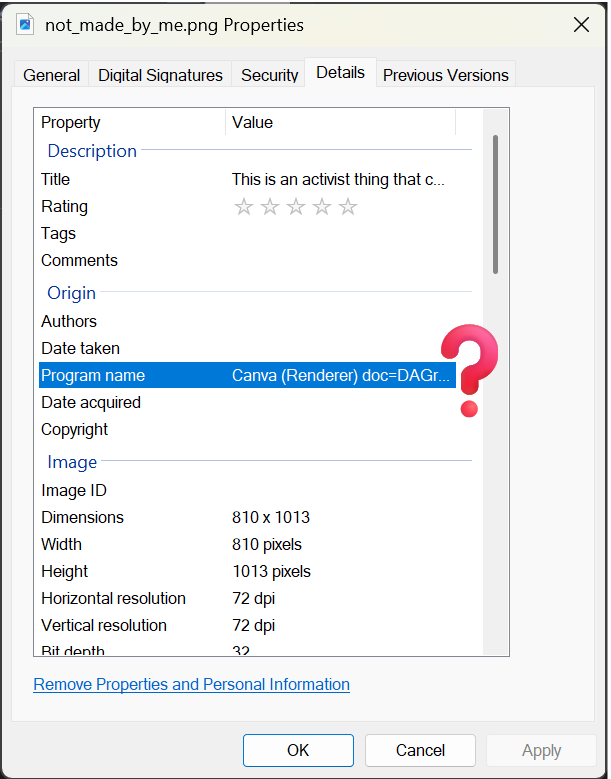
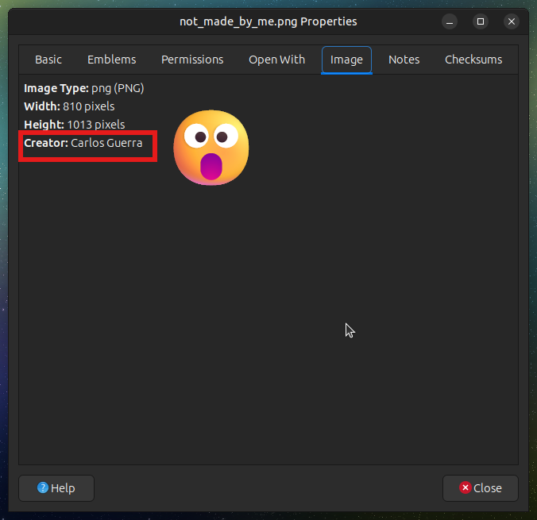
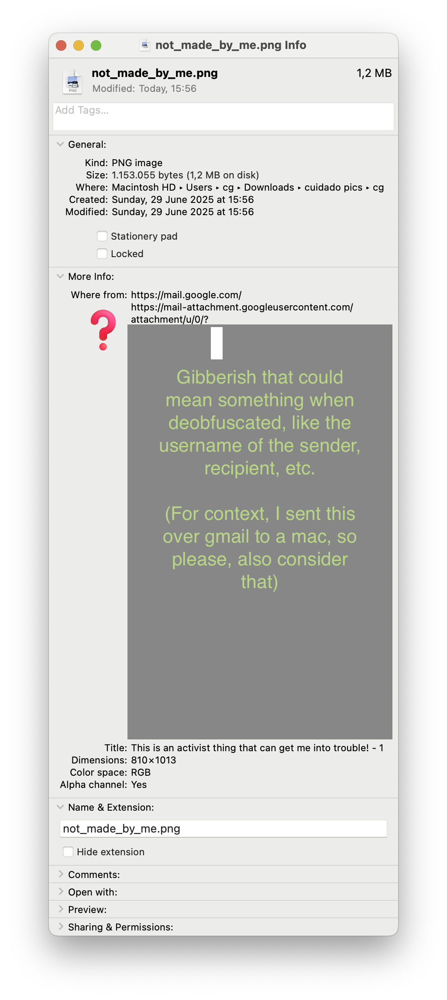

Now, if we use a tool for extracting the metadata in a more professional way (exiftool for the curious), we get this on the file (spoiler: 😐 You can see my name, that I used Canva to create the image with documents and user id, and some other weird fields that I couldn't find much about 🤔)

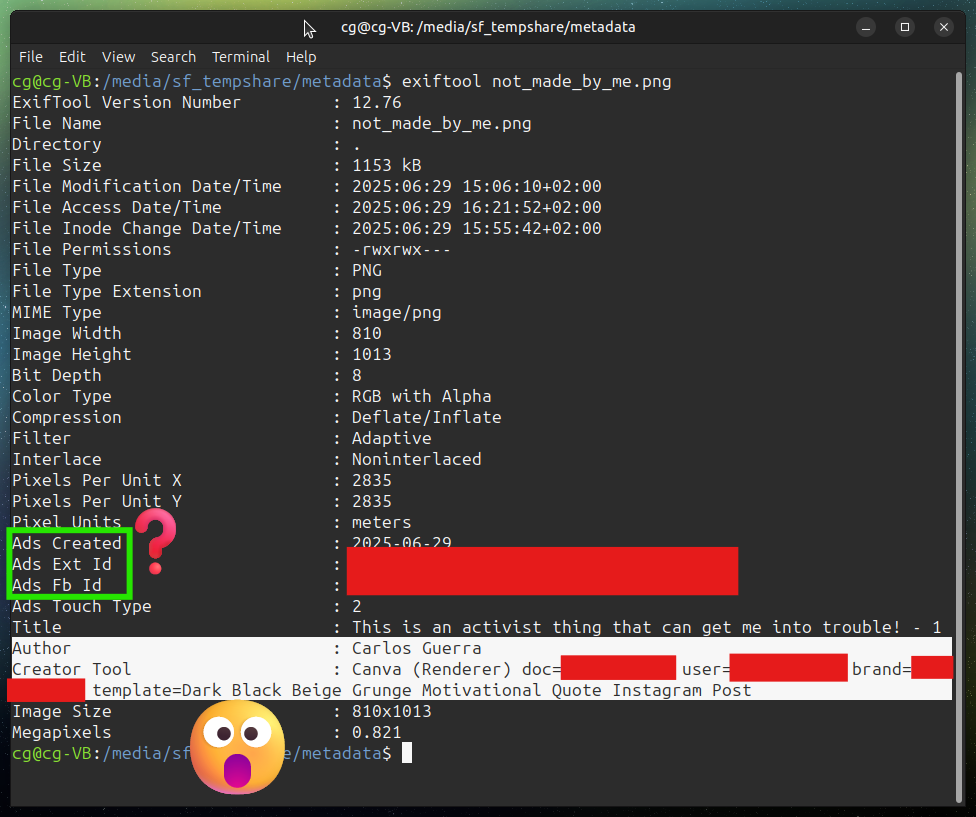

> PAUSE! Before we get too stressed, let's say something actually good and helpful: if we send the picture over Signal or WhatsApp, this data will be deleted (mostly because the platform creates its own version of the picture, hopefully optimized). This example is for the same image on Signal

> 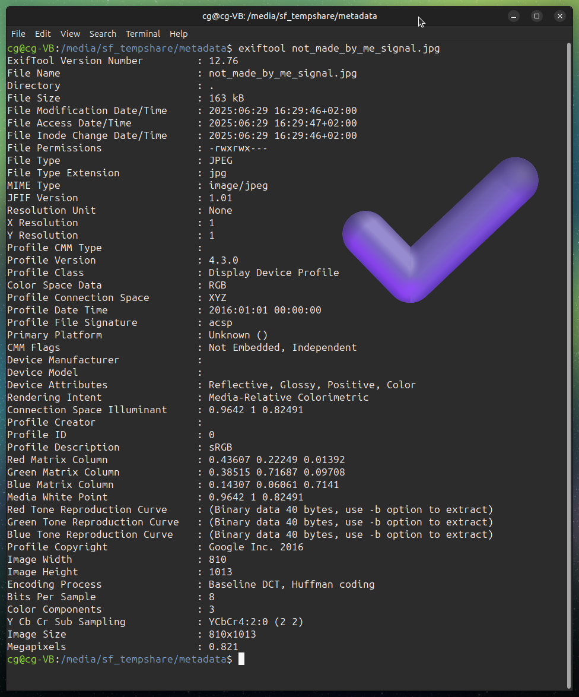

Ok, so back to the original file: if you are comfortable enough to run tools on the command line, exiftool, the one we used to check the existing metadata, can also remove it in a new version of the image. In this case by running "exiftool -all= not_made_by_me.png"

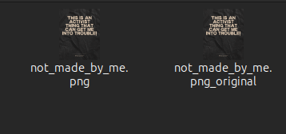
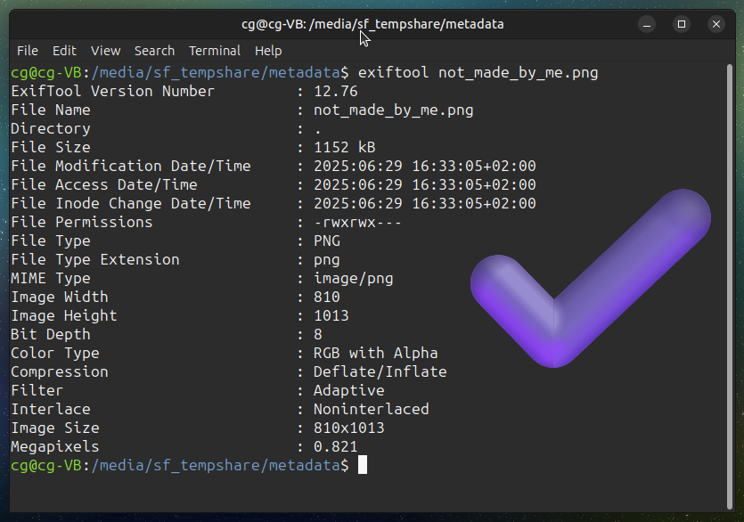

However, if using exiftool is difficult (or just annoying), there are other ways. For instance, in macOS, you can right-click the file, go to "Quick Actions", and select "Convert Image" to create a new version of the file; just uncheck the option "Preserve Metadata" and you should be good to go :)

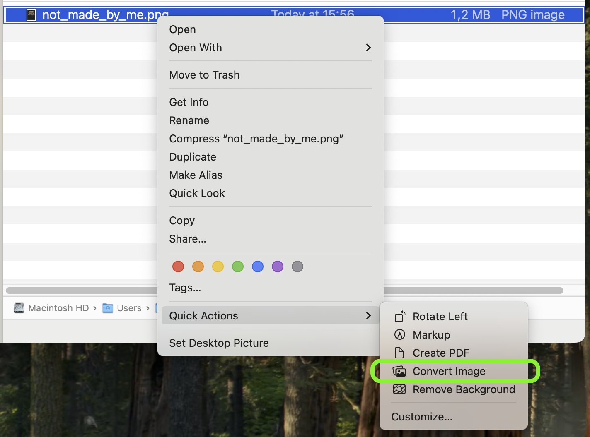
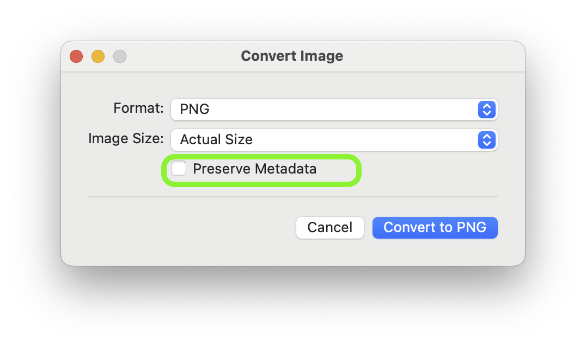
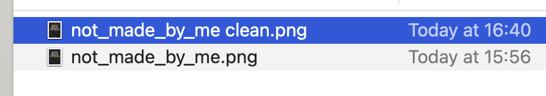
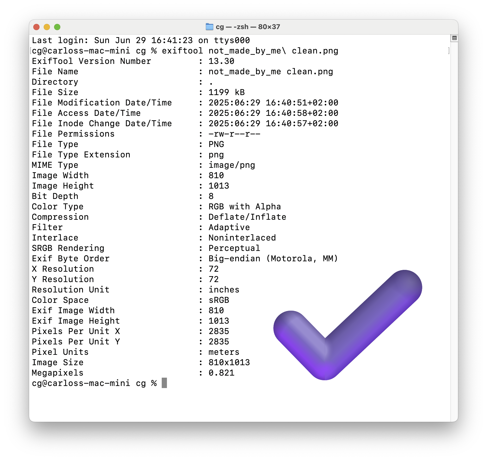

Please keep in mind that:

- There are many edge cases, but if you create the images, it should be ok with the information on this thread.
- In Windows/Linux, removing metadata reliably might require extra tools if you want a Graphical User Interface (GUI)
- This example covers image file formats, so other file formats will have other nuances. For instance, the "Convert Image" approach on macOS won't work for a PDF document.
- The image itself might contain personal information that is not related to the metadata (photos, specific signs, etc.)